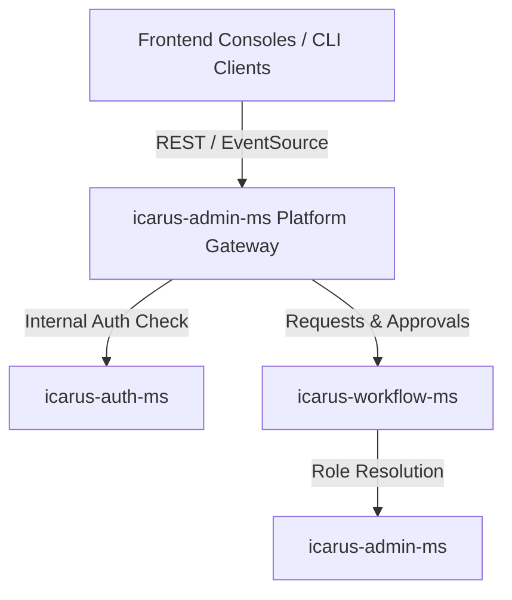

# Icarus - Pluggable IAM & RBAC Management Engine

Icarus is a developer-centric, pluggable Identity & Access Management (IAM) and Role-Based Access Control (RBAC) platform. It is designed to help companies rapidly deploy secure, robust, and highly flexible IAM and RBAC solutions with ease—eliminating the complexity of building and maintaining custom Auth microservices from scratch. 

As business needs evolve, Icarus continues to expand, offering full coverage and the agility required to match any company's security policies and architectural design needs.

---

## 🚀 Key Value Proposition & Features

* **Out-of-the-Box Authentication & Authorization:** Instant setup for user login, registration, and token validation (JWKS).
* **Developer Independence:** Downstream microservices consume standard JWTs and verify signatures via public keys, freeing developers from authentication boilerplates.
* **Granular RBAC Engine:** Map permissions dynamically to roles, manage role hierarchies, and define tenant-scoped access.
* **Onboarding & Microservice Governance:** Seamlessly register new application modules, tenants, and clients to scale the system.
* **Self-Service Access Requests:** User-friendly cart-based request workflow with custom multi-stage approval paths, inbox delegations, and real-time SSE notifications.
* **Tree-Like Role Grouping:** Roles grid features tree-like grouping by applications and modules, optimized to scale efficiently for 1,000+ roles.
* **User Access Comparison:** Side-by-side role and permission comparison tool to identify access discrepancies between users.
* **Active Directory / LDAP Sync:** Native configuration, testing, and synchronization of user directories with LDAP databases.
* **Interactive Workflow Builder:** Visual administration of multi-stage approval templates mapped to specific system roles.

---

## 🏗️ Architecture & Component Overview

Icarus is structured as a collection of decoupled, lightweight Go microservices and a modern Angular administrative console:



### 1. [icarus-auth-ms](file:///Users/tengweihao/Projects/atlas/icarus/backend/icarus-auth-ms) (Authentication Microservice)
The core authentication provider responsible for credential validation, token minting, and user/client directories.
* **Authentication Flows:** Standard login, registration, profile updates (`/me`), and secure password rotation.
* **OAuth2-Style Client Credentials:** Dynamic registration of machine-to-machine clients and client token issuance.
* **JWKS Provider:** Automatic generation and rotation of RSA cryptographic key pairs; publishes certificates via standard JWKS (`/certs`).
* **Active Directory / LDAP Sync:** Native integration for configuring, testing, and syncing user groups from LDAP databases.
* **RBAC Directory:** CRUD management for Users, Roles, Clients, and Permissions.

### 2. [icarus-admin-ms](file:///Users/tengweihao/Projects/atlas/icarus/backend/icarus-admin-ms) (Governance & Policy Engine)
The administrative gatekeeper handling platform-wide metadata, tenants, and API gateway routing.
* **Platform Gateway:** Smart reverse proxy handling rate-limiting and access token validation for downstream endpoints.
* **Governance Onboarding:** Register backend microservice modules and manifest configurations.
* **Tenant & App Management:** Provision new business tenants, register modular applications, and onboard them to specific modules.
* **Internal Resolution:** Exposes internal endpoints for other microservices to resolve role hierarchies and memberships.

### 3. [icarus-workflow-ms](file:///Users/tengweihao/Projects/atlas/icarus/backend/icarus-workflow-ms) (Self-Service Access Request Service)
Orchestrates requests and approvals for roles and permission upgrades.
* **Access Carts:** Add permission requests to a self-service cart, submit, withdraw, or bump requests.
* **Approver Inbox:** Dashboard for role approvers to approve, reject, or delegate incoming access steps.
* **Dynamic Workflows:** Define custom multi-stage approval templates mapped to roles, complete with definition version history and conflict resolution.
* **Real-time Updates:** Push notifications to approvers and requesters via Server-Sent Events (SSE).
* **Auditing:** In-depth instance audit trails capturing every state transition.

### 4. [icarus-frontend](file:///Users/tengweihao/Projects/atlas/icarus/frontend/icarus-frontend) (Admin Console)
A responsive administrative web console built in Angular.
* **Administration Dashboards:** Manage users, API clients, tenant boundaries, modules, and workflows.
* **Self-Service Portal:** Access cart for access requests, approvals inbox, and request audit timelines.

---

## 🛠️ Getting Started & Bootstrapping

To set up and run the Icarus microservices locally:

### 1. Environment Setup
Create the required environment files under each service's `env/` directory. Refer to [DEPLOYMENT.md](file:///Users/tengweihao/Projects/atlas/icarus/DEPLOYMENT.md) for details on secrets and database setup.

### 2. Startup Scripts
Use the startup script in the root directory to run all services concurrently:
```bash
./start.sh
```

### 3. Service Verification
Ensure all services are running and reporting healthy statuses:
* **Auth MS:** `http://localhost:8080/health`
* **Admin MS:** `http://localhost:8081/health`
* **Workflow MS:** `http://localhost:8082/health`
